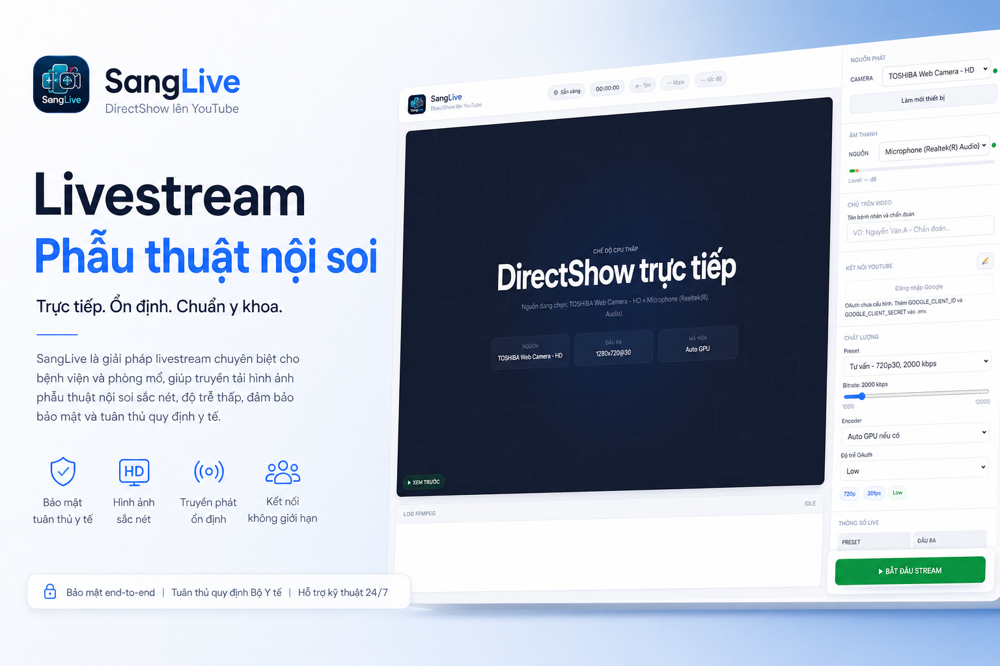
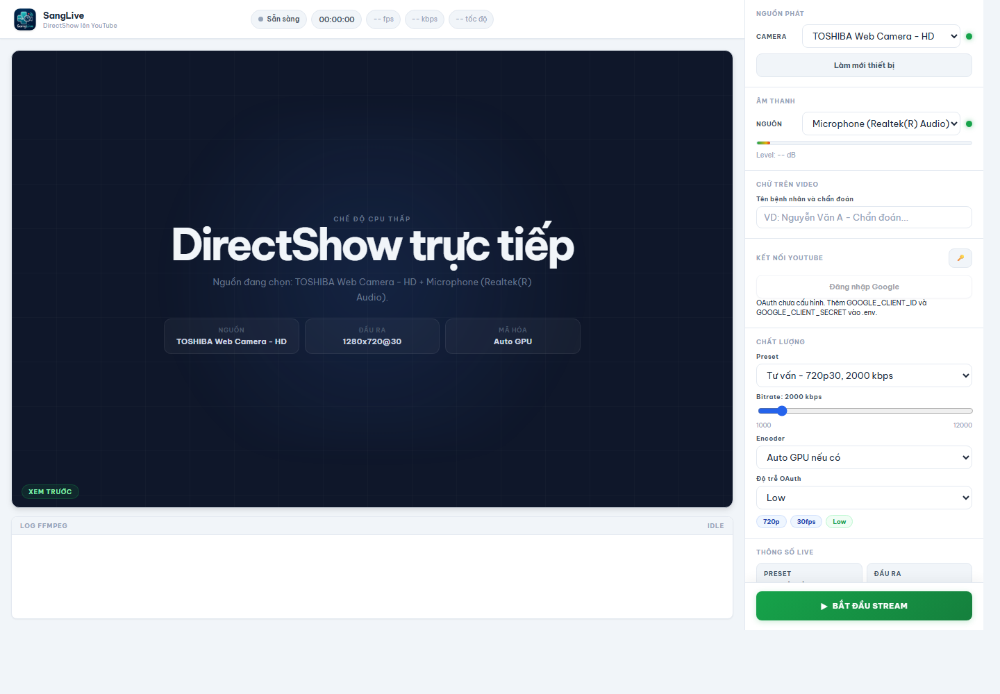
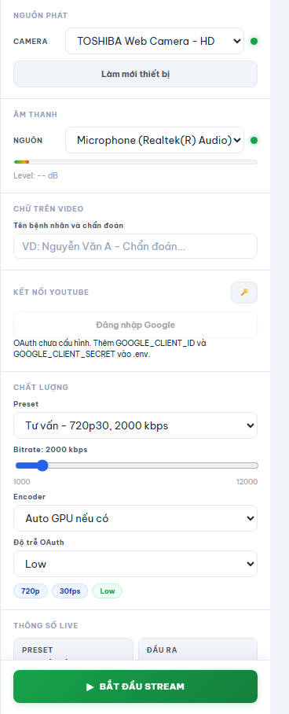

# SangLive

SangLive là ứng dụng livestream YouTube tối ưu CPU cho phòng tư vấn/phẫu thuật. Trình duyệt chỉ làm giao diện điều khiển, còn FFmpeg đọc camera Windows trực tiếp bằng DirectShow và đẩy RTMP lên YouTube.



## Cài đặt nhanh

Yêu cầu máy Windows đã có Node.js 20 LTS.

```powershell
powershell -NoProfile -ExecutionPolicy Bypass -Command "iwr -UseBasicParsing https://raw.githubusercontent.com/thsangyk-oss/sanglive/main/install-from-github.ps1 | iex"
```

Sau khi cài xong, Desktop sẽ có shortcut `SangLive`.

Shortcut có cơ chế tự kiểm tra:

- Backend đang chạy ổn ở `http://localhost:8788` thì chỉ mở frontend.
- Backend chưa chạy hoặc port `8788` bị treo thì dừng process đang chiếm port, start backend mới, rồi mở frontend.

## Giao diện



### Panel cài đặt



## Chạy thủ công

Clone repo và chạy installer nội bộ:

```powershell
git clone https://github.com/thsangyk-oss/sanglive.git
cd sanglive
powershell -NoProfile -ExecutionPolicy Bypass -File .\install.ps1
```

Hoặc mở trực tiếp:

```bat
start.bat
```

URL mặc định:

```text
http://localhost:8788
```

## OAuth YouTube

Sao chép `.env.example` thành `.env`, rồi điền Google OAuth credentials:

```env
GOOGLE_CLIENT_ID=...
GOOGLE_CLIENT_SECRET=...
GOOGLE_REDIRECT_URI=http://localhost:8788/auth/callback
PORT=8788
```

Khi OAuth đã cấu hình, SangLive có thể đăng nhập Google, tạo livestream YouTube và bắt đầu stream từ trong app. Nếu chưa cấu hình OAuth, có thể nhập stream key thủ công bằng nút chìa khóa trong panel YouTube.

## Tính năng chính

- Đọc camera Windows bằng DirectShow để giảm tải cho trình duyệt.
- Stream YouTube qua OAuth hoặc stream key thủ công.
- Preset nhanh cho tư vấn `720p30` và phẫu thuật `1080p60`.
- Tự chọn encoder GPU nếu máy hỗ trợ NVENC/QSV/AMF.
- Overlay tên bệnh nhân/chẩn đoán và logo phát sóng.
- Log FFmpeg riêng cho từng lần live để debug dễ hơn.

## Log debug

Mỗi lần bấm live, app tạo một file log trong thư mục:

```text
logs/
```

Tên file có dạng:

```text
live-YYYY-MM-DDTHH-mm-ss-sssZ-camera.log
```

Log gồm cấu hình start, FFmpeg stderr, restart/fallback encoder và lý do stop/error.

## Lưu ý

- Cần chạy trên Windows có camera DirectShow.
- Nên chọn `Encoder = Auto GPU nếu có` để dùng NVENC/QSV/AMF nếu máy hỗ trợ.
- Nếu camera không mở được `1080p60`, chọn preset Tư vấn hoặc Custom `1080p30`.
- SangLive không có canvas preview để giảm CPU tối đa.
